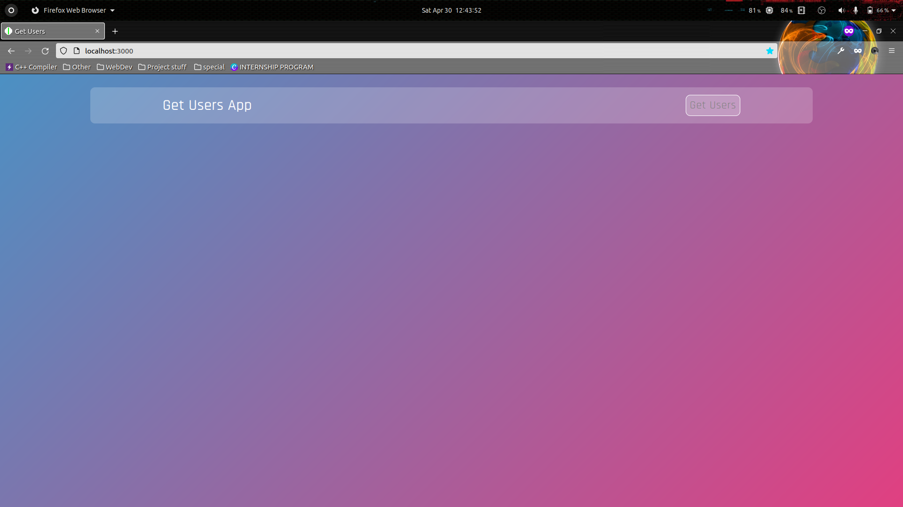

# Get users with loading

---

## Screenshot:



---

## Run app on your local machine:

- Clone the repository
  ```
  git clone https://github.com/Rohit-Saini7/lgm-getusers.git
  ```
- Open the project in your favorite editor
  ```
  cd lgm-getusers/
  ```
- Install the dependencies
  ```
  npm i
  ```
- Run the project in your local machine
  ```
  npm start
  ```

---

Do fork and star ⭐ the repo if you find it appreciable. For any queries and suggestions, Conatct me at my mailing address.
